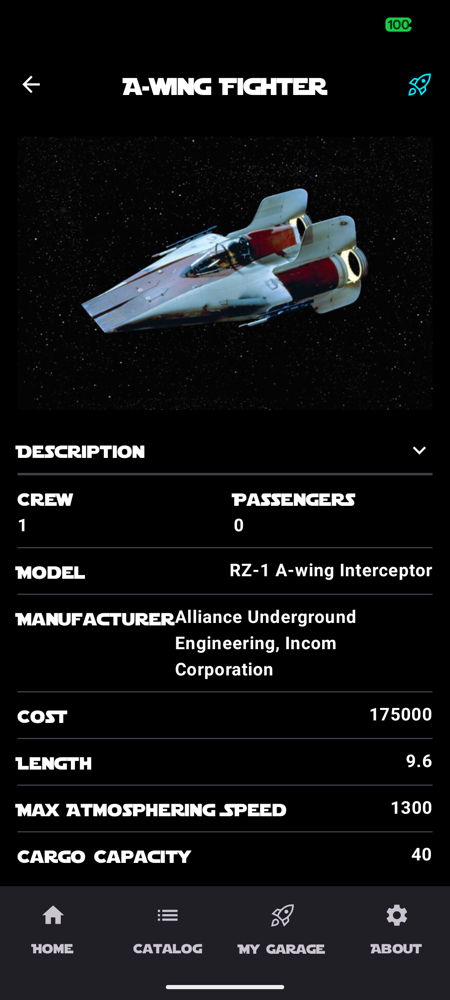
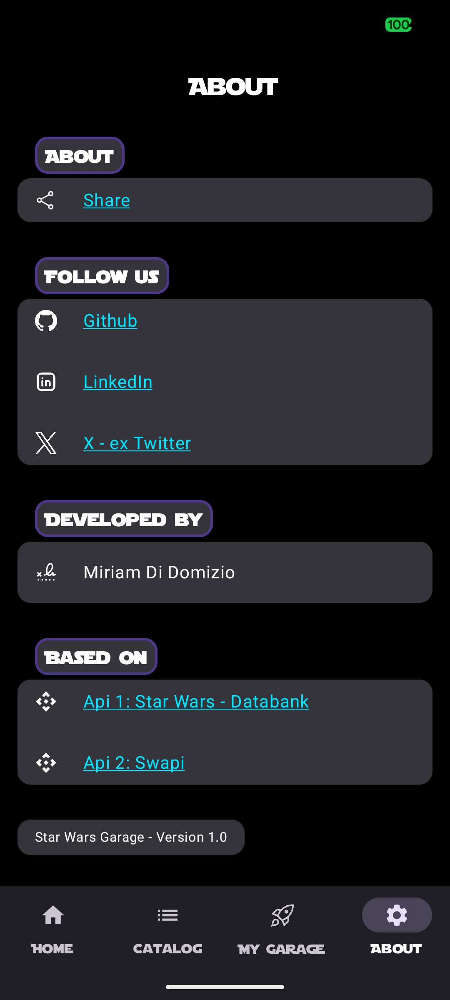

## Hi there 👋 I'm Miriam!

I develop Android Apps with Kotlin.

📱 Currently at **Zalando SE**  
📫 How to reach me:
[✉️ Email](mailto:miriam.didomizio@gmail.com) · [𝕏 Twitter](https://x.com/MiriamDiDomizio) · [💼 LinkedIn](https://www.linkedin.com/in/miriam-di-domizio-25b8ab12b)

---

### 🚀 Featured App — Star Wars Garage

An Android app that displays **Star Wars starships**, fetching data from two public APIs:

- [Star Wars Databank](https://starwars-databank.vercel.app/)
- [SWAPI (Star Wars API)](https://swapi.info/)

Built with a modern, clean UI using **Jetpack Compose**, this project is part of my **Android/Kotlin portfolio** and focuses on best practices in architecture, performance, and modern Android development.

---

### 📸 Screenshots

<table>
  <tr>
    <td align="center"> 🏠 Home</td>
    <td align="center"> 📋 Catalog</td>
    <td align="center"> 🔍 Detail</td>
  </tr>
  <tr>
    <td align="center"> ⭐ Favorites</td>
    <td align="center"> ℹ️ About</td>
    <td></td>
  </tr>
</table>
