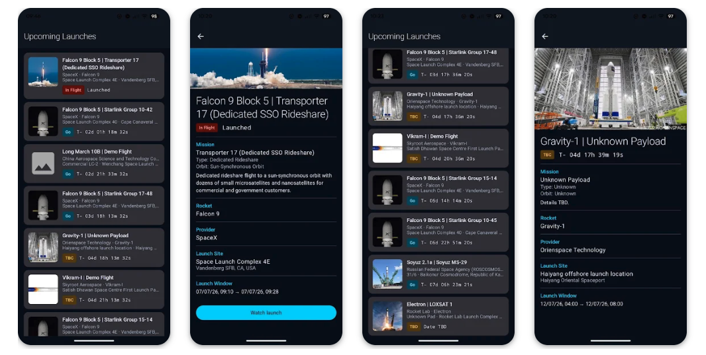

markdown
## Hi there 👋 I'm Miriam!

I develop Android Apps with Kotlin.

📱 Android Engineer, open to new opportunities
📫 How to reach me: [✉️ Email](mailto:miriam.didomizio@gmail.com) · [𝕏 Twitter](https://x.com/MiriamDiDomizio) · [💼 LinkedIn](https://www.linkedin.com/in/miriam-di-domizio-25b8ab12b)

---

### 🚀 Featured App — ShuttlesLaunch

Track upcoming rocket launches with live countdowns and mission details. Available now on [Google Play](https://play.google.com/store/apps/details?id=com.miriamdidomizio.shuttleslaunch).

Built with **Kotlin**, **Jetpack Compose**, **MVVM**, and **Hilt**, pulling live data from the Launch Library 2 API. Free, no ads, no account required.

---

### 🚀 Featured App — Star Wars Garage

An [Android app](https://github.com/mdidomizio/StarWarsGarage) that displays **Star Wars starships**, fetching data from two public APIs.
Built with a modern, clean UI using **Jetpack Compose**, this project is part of my **Android/Kotlin portfolio** and focuses on best practices in architecture, performance, and modern Android development.

<table>
  <tr>
    <td align="center"> 🏠 Home</td>
    <td align="center"> 📋 Catalog</td>
    <td align="center"> 🔍 Detail</td>
  </tr>
  <tr>
    <td align="center"> ⭐ Favorites</td>
    <td align="center"> ℹ️ About</td>
    <td></td>
  </tr>
</table>
